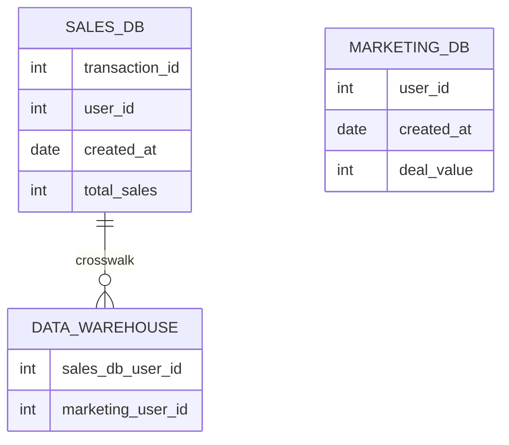

# What is Benjy?

Benjy is a data as code tool allowing users to 

* Declaratively define and build their data environment, in code.
* Define the relationships between data throughout an organization, in code.
* Data search, discovery, and lineage. 

Much like SQL allows you to define relationships between data within a single database, 
Benjy allows you to define relationships between data across multiple data resources (databases, flat files, APIs, etc...).
The end result is a graph expressing the relationships between all of your team or organization's data.

# How does it work?

Because Benjy already understands how your data relates to each other, it can generate complicated query plans for you. 
Imagine a typical organization with three 

**TODO**: Need to sort out the meaning of the connections

## 